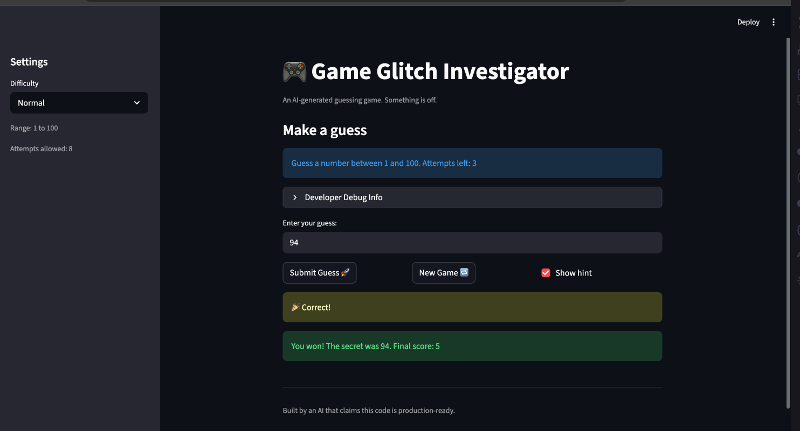

# 🎮 Game Glitch Investigator: The Impossible Guesser

## 🚨 The Situation

You asked an AI to build a simple "Number Guessing Game" using Streamlit.
It wrote the code, ran away, and now the game is unplayable.

- You can't win.
- The hints lie to you.
- The secret number seems to have commitment issues.

## 🛠️ Setup

1. Install dependencies: `pip install -r requirements.txt`
2. Run the broken app: `python -m streamlit run app.py`

## 🕵️‍♂️ Your Mission

1. **Play the game.** Open the "Developer Debug Info" tab in the app to see the secret number. Try to win.
2. **Find the State Bug.** Why does the secret number change every time you click "Submit"? Ask ChatGPT: _"How do I keep a variable from resetting in Streamlit when I click a button?"_
3. **Fix the Logic.** The hints ("Higher/Lower") are wrong. Fix them.
4. **Refactor & Test.** - Move the logic into `logic_utils.py`.
   - Run `pytest` in your terminal.
   - Keep fixing until all tests pass!

## 📝 Document Your Experience

- [ ] Describe the game's purpose.
      The game's purpose is to simulate the game of guessing the secret number with varying ranges based on difficulty. As the player, your goal is to guess the secret number while using less attempts. The game will prompt you to go higher or lower as you get closer to the secret number.

- [ ] Detail which bugs you found.

1. Misdirection of higher/lower. For example, when I type "1", the game will prompt me to go lower.
2. New game button didn't work.
3. Score didn't update correctly.

- [ ] Explain what fixes you applied.

1. Swap the messages for higher and lower.
2. Refactor the game's core mechanics to logic file
3. Fix new game button by including additonal lines that allow player to insert first guess
4. Fix incorrect score issuing by removing intentional even/odd condition

## 📸 Demo

- []

## 🚀 Stretch Features

- [ ] [If you choose to complete Challenge 4, insert a screenshot of your Enhanced Game UI here]
